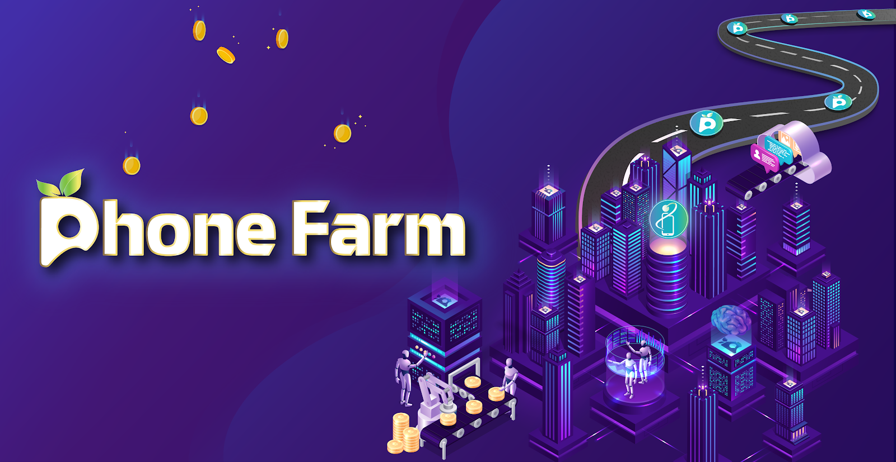
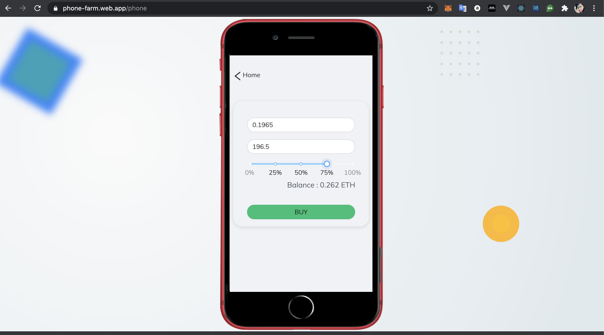
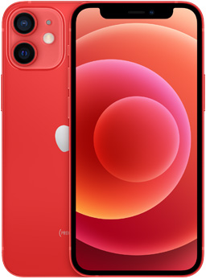
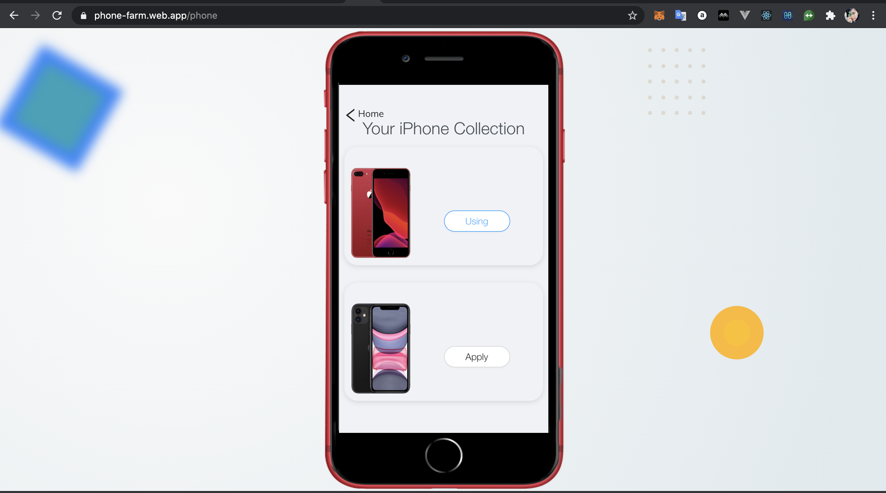

<h1 align="center">
   
      
   
  PhoneFarm Finance
   
</h1>

- PhoneFarm aims to build up a tokenized system for mobile devices, together with the creation of new, beautiful and rare phones on the blockchain platform. Moreover, it can be purchased by the only token - **IPHONE** token.

- What is more, **PhoneFarm** desires to build a tokenized ecosystem with both phones and all other electronic devices such as tablets, laptops, accessories,...as well.

 
      
   

## PHONE Token

**PHONE** Token follows the **ERC20** standard, which is called **PhoneFarm**. Its symbol is PHONE and decimals is 18, meaning 1 PHONE could be subdivided 10^18 times, similar to ETH.

**PHONE** is a token used for **Staking**. User needs to buy **PHONE** to put it in pools, it is like raw materials.

  

      
       
      <b>PHONE Token</b>
  

## How to get PHONE token

In the future, **PHONE token** will be listed on Uniswap and centralized exchanges. At present, users can buy directly on the app via the contract **Presale.sol**. Each current **PHONE** token is converted with a value equal to 1/1000 **ETH**. In the future, we will integrate **Chainlink Oracle** into the contract so that users can buy PHONE tokens with many different tokens.

      
       
      <b>Buy PHONE Token</b>
  

## Stake and Receive Rewards

Users can choose a variety of ERC20 to stake for IPHONE token such as **LINK**, **USDT**, **DAI** ... However, those who use the PHONE token will increase their chances of getting IPHONE token than other erc20 tokens

Stake your **PHONE** to receive rewards through each block. This reward will be paid by **IPHONE** token (ERC-20).

      
       
      <b>IPHONE Token</b>
  

Formula to calculate the amount of **IPHONE token** generated per user can be illustrated through the following example:

PhoneFarm has 3 pool with a weight in each pool

- Pool 1: Stake by LINK, weight is 2
- Pool 2: Stake by DAI, weight is 3
- Pool 3: Stake by PHONE, weight is 5

Each block, will be have 10 **IPHONE** token minted when each pool will be received:

- Pool 1: 2 IPHONE/block
- Pool 2: 3 IPHONE/block
- Pool 3: 5 IPHONE/block

Alice, Bob and Eve stake sequence 1, 2, 7 **PHONE** token into pool 3. So, each block, they will be received:

- Alice: (1 \* 5) / 10 = 0.5 **IPHONE**
- Bob: (2 \* 5) / 10 = 1 **IPHONE**
- Eve: (7 \* 5) / 10 = 3.5 **IPHONE**

_Note_ : 1 person can stake into many pool

## Mint NFTs

      
  

With **IPHONE** token, we can use it to mint new **IPHONE** NFT cards, which can be used to change your phone looks on home page, and also you can list those on NTF markets, too.

      
  

## LICENSE

© 2020 - PhoneFarm Project
